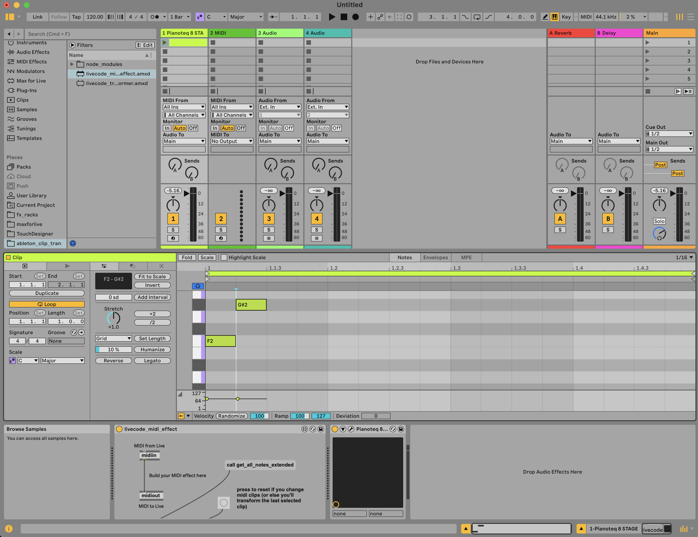

## Ableton clip livecoding

This project is a proof of concept for livecoding MIDI clip transformations using Node and Max for Live. 
The basic idea is that a Max Midi Effect grabs the clip data from the clip that is open in the clip view, and sends it to a Node server. 
The Node server can then transform the notes in the clip, and send the transformed notes back to the Max device. 

Launching the node server with [nodemon](https://www.npmjs.com/package/nodemon) allows you to livecode the node server.

New in Live 12, you can look at the clip editor view and a track's devices at the same time, allowing you to build custom editing interfaces in a Max For Live device. This proof of concept simply includes a single button to transform the clip, but much more is possible. 

### Installing

##### Node server

run npm install to install the node modules

run npm install -g nodemon to globally install nodemon to allow for hot reloading

##### Max
you'll need to make sure you have the OpenSoundControl Max package installed.

### Running

run nodemon index.ts to start the server

Add the livecode_midi_effect Max device to any midi track. 

Open the editor window for a clip on that track, and also open the device view beneath the clip view (only possible in Live 12).
- the device automatically acts on whatever clip is active in the clip view

Live code any function to transform the input notes in Node, and nodemon will update the node server. 

Press the "call get_all_notes_extended" button in the max for live device to trigger the transformation.

